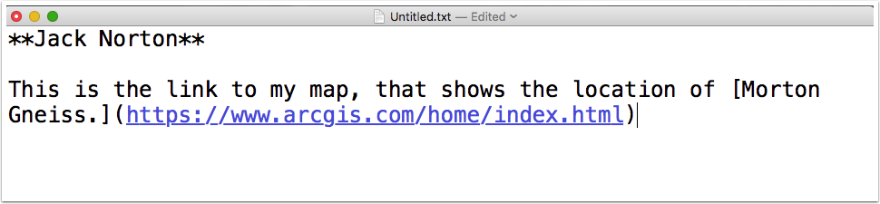

#Getting started with GIS: MN Prehistory. 

## 1. Minnesota Prehistory and Global Information Systems

The learning goals of this assignment are: 

1. To learn how to use ArcGIS to link historical information to geographic information.

2. To demonstrate how to link different types of digital information to explain the past. 

3. To connect your weekly readings to digital tools. 

## 2. Navigate to https://www.arcgis.com/home/index.html to create an account. 

## 3. Create an account using your information, not through Google or Facebook. 

## 4. Use your real name for your username. 

Please be sure to write down your password. 

## 5. Once you have an account, please click on map.

## 6. Navigate to MNopedia | Minnesota Encyclopedia at mnopedia.org

## 7. Chose an article on premodern Minnesota (do not use Morton Gneiss). 

## 8. Under "Add," select "Add Map Notes. 

## 9. Select "stickpin"

When the stickpin dialogue box opens, put the URL for your MnOpedia article in. 

Explain how your article relates to one fact in one of the articles we read for this week. 

## 10. Save your map. 

## 11. Click on share you map. 

Copy the link to your map. 

## 12. Create a document, written in Markdown, as below. 

Save your document and upload it to D2L Assignments Folder, Week 2. 

## 13. Grading Rubric

1. Student appropriately logged into ArcGIS. 

2. Student created a map that included a correct URL to a MNOpedia article. 

3. Student explained how MnOpedia article relates to one of our readings for the week. 

4. Student correctly composed a markdown document with correct link to ArcGIS map. 

